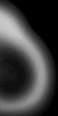

# Three fire

[](https://github.com/typeWolffo/THREE.Fire/actions)
[](https://github.com/typeWolffo/THREE.Fire/actions)
[](https://github.com/typeWolffo/THREE.Fire)
[](https://www.npmjs.com/package/@wolffo/three-fire)
[](https://www.npmjs.com/package/@wolffo/three-fire)

Modern TypeScript volumetric fire effect for Three.js and React Three Fiber.


[Live Demo](https://threefire.netlify.app/)

## Features

- 🔥 Volumetric fire effect using ray marching
- ⚡ **NEW**: TSL (Three.js Shading Language) support with modern node-based shaders
- 📦 TypeScript support with full type definitions
- ⚛️ React Three Fiber component
- 🎛️ Configurable parameters (iterations, octaves, noise scale, etc.)
- 🚀 Modern Three.js compatibility (r150+)
- 📱 Optimized for performance
- 🎯 Multiple entry points for optimal bundle size

## Installation

```bash
npm install @wolffo/three-fire
```

## Entry Points Summary

This package provides separate entry points to optimize bundle size and avoid unnecessary dependencies:

### Standard GLSL Shaders (Recommended for most users)
| Entry Point | Use Case | Bundle Size | Dependencies |
|-------------|----------|-------------|--------------|
| `@wolffo/three-fire/vanilla` | Vanilla Three.js projects | Smallest | Only Three.js |
| `@wolffo/three-fire/react` | React Three Fiber projects | Medium | React + Three.js |

### TSL (Three.js Shading Language) - Modern Node-Based Shaders
| Entry Point | Use Case | Bundle Size | Dependencies |
|-------------|----------|-------------|--------------|
| `@wolffo/three-fire/tsl` | TSL-only projects | Small | Three.js + TSL modules |
| `@wolffo/three-fire/vanilla-tsl` | Vanilla with both options | Medium | Three.js + TSL modules |
| `@wolffo/three-fire/react-tsl` | React with both options | Large | React + Three.js + TSL modules |

### Legacy (Backward Compatibility)
| Entry Point | Use Case | Bundle Size | Dependencies |
|-------------|----------|-------------|--------------|
| `@wolffo/three-fire` | Legacy/mixed usage | Largest | All dependencies |

**📈 Migration Guide**: 
- **Standard Fire users** → use `/vanilla` or `/react` 
- **TSL enthusiasts** → use `/tsl`, `/vanilla-tsl`, or `/react-tsl`
- **Both options needed** → use `/vanilla-tsl` or `/react-tsl`

## Usage

### React Three Fiber (Standard GLSL)

```tsx
import { Canvas } from '@react-three/fiber'
import { Fire } from '@wolffo/three-fire/react'

function App() {
  return (
    <Canvas>
      <Fire
        texture="/fire-texture.png"
        color={0xff4400}
        scale={[2, 3, 2]}
        position={[0, 0, 0]}
      />
    </Canvas>
  )
}
```

### With custom parameters

```tsx
import { Fire, useFire } from '@wolffo/three-fire/react'

function CustomFire() {
  const fireRef = useFire()

  return (
    <Fire
      ref={fireRef.ref}
      texture="/fire-texture.png"
      color={0xff6600}
      magnitude={1.5}
      lacunarity={2.5}
      gain={0.7}
      iterations={25}
      octaves={4}
      onUpdate={(fire, time) => {
        // Custom update logic
        fire.fireColor.setHSL((time * 0.1) % 1, 1, 0.5)
      }}
    />
  )
}
```

### Vanilla Three.js

```ts
import { FireMesh } from '@wolffo/three-fire/vanilla'
import { Scene, TextureLoader } from 'three'

const scene = new Scene()
const textureLoader = new TextureLoader()

// Load fire texture
const fireTexture = textureLoader.load('/fire-texture.png')

// Create fire effect
const fire = new FireMesh({
  fireTex: fireTexture,
  color: 0xff4400,
  magnitude: 1.3,
  iterations: 20,
  octaves: 3
})

scene.add(fire)

// Animation loop
function animate() {
  requestAnimationFrame(animate)

  fire.update(performance.now() / 1000)
  renderer.render(scene, camera)
}
animate()
```

### ⚡ TSL (Three.js Shading Language) - Modern Node-Based Shaders

TSL provides better performance and maintainability through Three.js's modern node-based shader system.

#### TSL React Components

```tsx
import { Canvas } from '@react-three/fiber'
import { NodeFire } from '@wolffo/three-fire/react-tsl'

function App() {
  return (
    <Canvas>
      <NodeFire
        texture="/fire-texture.png"
        color={0xff4400}
        scale={[2, 3, 2]}
        position={[0, 0, 0]}
      />
    </Canvas>
  )
}
```

#### TSL Vanilla Three.js

```ts
import { NodeFireMesh } from '@wolffo/three-fire/tsl'
import { Scene, TextureLoader } from 'three'

const scene = new Scene()
const textureLoader = new TextureLoader()

// Load fire texture
const fireTexture = textureLoader.load('/fire-texture.png')

// Create TSL-based fire effect
const fire = new NodeFireMesh({
  fireTex: fireTexture,
  color: 0xff4400,
  magnitude: 1.3,
  iterations: 20,
  octaves: 3
})

scene.add(fire)

// Animation loop
function animate() {
  requestAnimationFrame(animate)
  fire.update(performance.now() / 1000)
  renderer.render(scene, camera)
}
animate()
```

#### Using Both Standard and TSL Together

```tsx
import { Fire, NodeFire } from '@wolffo/three-fire/react-tsl'

function App() {
  return (
    <Canvas>
      {/* Standard GLSL Fire */}
      <Fire texture="/fire.png" color="orange" position={[-2, 0, 0]} />
      
      {/* Modern TSL Fire */}
      <NodeFire texture="/fire.png" color="blue" position={[2, 0, 0]} />
    </Canvas>
  )
}
```

### Legacy Usage (Backward Compatibility)

⚠️ **Not recommended for new projects** - use specific entry points above for better performance.

```ts
// Legacy import - includes all dependencies
import { FireMesh, Fire } from '@wolffo/three-fire'
```

## API Reference

### Standard Fire Components

#### FireComponent Props

| Prop | Type | Default | Description |
|------|------|---------|-------------|
| `texture` | `string \| Texture` | - | Fire texture URL or Three.js Texture object |
| `color` | `Color \| string \| number` | `0xeeeeee` | Fire color |
| `iterations` | `number` | `20` | Ray marching iterations (higher = better quality, lower performance) |
| `octaves` | `number` | `3` | Noise octaves for turbulence |
| `noiseScale` | `[number, number, number, number]` | `[1, 2, 1, 0.3]` | Noise scaling factors |
| `magnitude` | `number` | `1.3` | Fire shape intensity |
| `lacunarity` | `number` | `2.0` | Noise lacunarity |
| `gain` | `number` | `0.5` | Noise gain |
| `autoUpdate` | `boolean` | `true` | Auto-update time from useFrame |
| `onUpdate` | `(fire, time) => void` | - | Custom update callback |

#### FireMesh Class

```ts
class FireMesh extends Mesh {
  constructor(props: FireMeshProps)

  // Methods
  update(time?: number): void

  // Properties
  time: number
  fireColor: Color
  magnitude: number
  lacunarity: number
  gain: number
}
```

### TSL Fire Components

#### NodeFireComponent Props

TSL components use the same props as standard Fire components but with improved performance through node-based shaders.

| Prop | Type | Default | Description |
|------|------|---------|-------------|
| `texture` | `string \| Texture` | - | Fire texture URL or Three.js Texture object |
| `color` | `Color \| string \| number` | `0xeeeeee` | Fire color |
| `iterations` | `number` | `20` | Ray marching iterations |
| `octaves` | `number` | `3` | Noise octaves for turbulence |
| `noiseScale` | `[number, number, number, number]` | `[1, 2, 1, 0.3]` | Noise scaling factors |
| `magnitude` | `number` | `1.3` | Fire shape intensity |
| `lacunarity` | `number` | `2.0` | Noise lacunarity |
| `gain` | `number` | `0.5` | Noise gain |
| `autoUpdate` | `boolean` | `true` | Auto-update time from useFrame |
| `onUpdate` | `(fire, time) => void` | - | Custom update callback |

#### NodeFireMesh Class

```ts
class NodeFireMesh extends Mesh {
  constructor(props: NodeFireMeshProps)

  // Methods
  update(time?: number): void

  // Properties
  time: number
  fireColor: Color
  magnitude: number
  lacunarity: number
  gain: number
  fireTex: Texture
  noiseScale: Vector4
  seed: number
  iterations: number (read-only)
  octaves: number (read-only)
}
```

#### Hooks

```ts
// Standard Fire hook
const fireRef = useFire()

// TSL NodeFire hook  
const nodeFireRef = useNodeFire()
```

### TSL Benefits

- **Better Performance**: Node-based shaders are optimized by Three.js
- **Maintainability**: Easier to modify and extend shader logic
- **Future-Proof**: Aligns with Three.js roadmap and modern rendering techniques
- **Debugging**: Better error reporting and debugging capabilities
- **Modularity**: Reusable shader components and functions

## Fire Texture

You need to provide a fire texture similar to the one shown below:



The texture should be a grayscale gradient that defines the fire's density distribution.

## Performance Tips

- Lower `iterations` for better performance (try 10-15 for mobile)
- Reduce `octaves` to 2 for simpler noise
- Use texture compression for the fire texture
- Consider using LOD (Level of Detail) for distant fires

## Development

```bash
# Install dependencies
npm install

# Build the package
npm run build

# Type checking
npm run typecheck

# Run tests
npm test

# Test in watch mode
npm run test:watch

# Visual test UI
npm run test:ui

# Coverage report
npm run test:coverage

# Run examples
npm run dev:examples          # Main examples
npm run dev:examples-node      # Node.js examples with TSL demo
```

### Testing

- **Unit tests** for Fire class and FireShader
- **Integration tests** for React components
- **Mock environment** for Three.js and React Three Fiber

Test files are located in `test/` and use Vitest with Testing Library.

## Credits

Based on the original THREE.Fire by [mattatz](https://github.com/mattatz/THREE.Fire)

- Real-Time procedural volumetric fire - http://dl.acm.org/citation.cfm?id=1230131
- webgl-noise - https://github.com/ashima/webgl-noise
- Three.js - https://threejs.org/

## License

MIT
